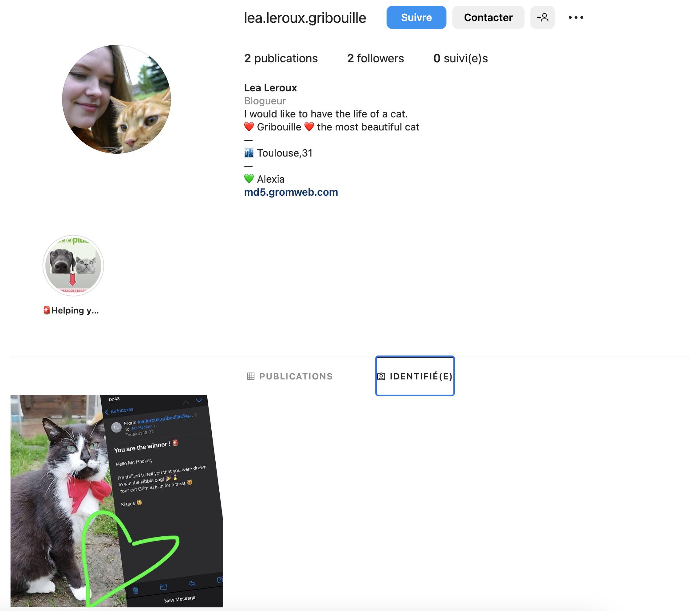
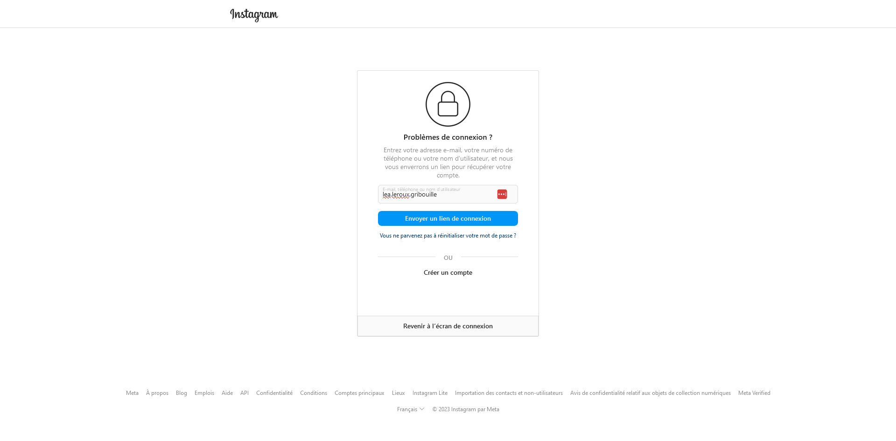
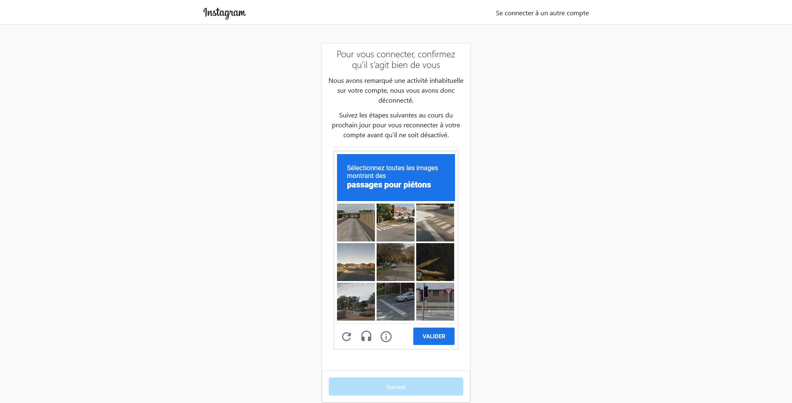
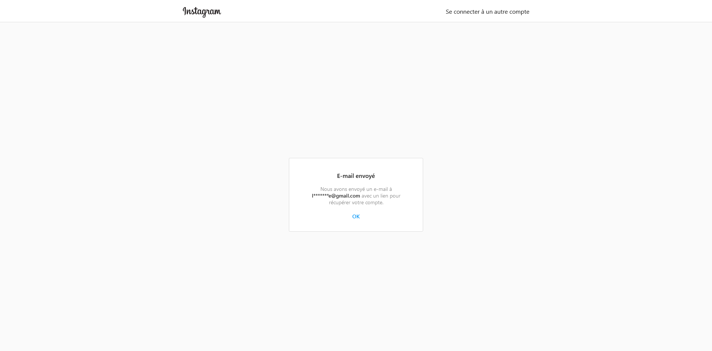
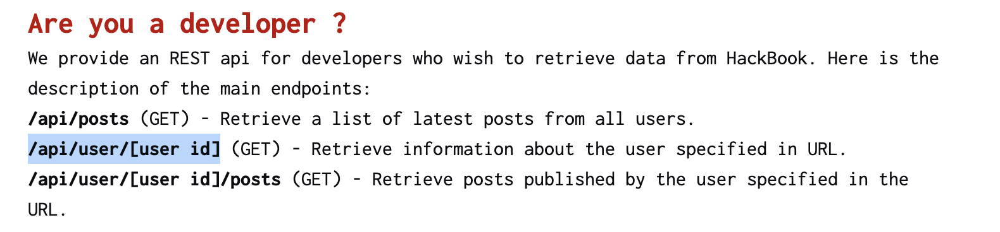
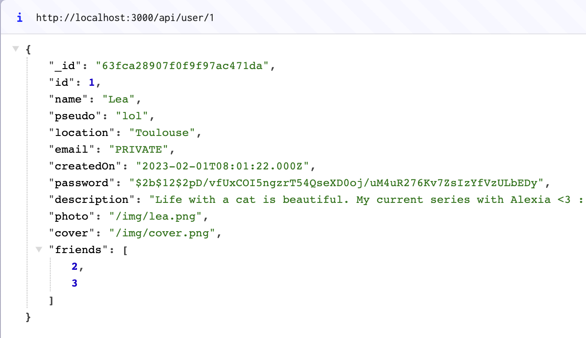
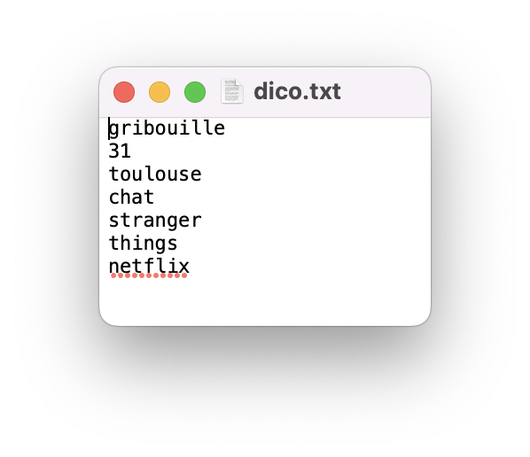
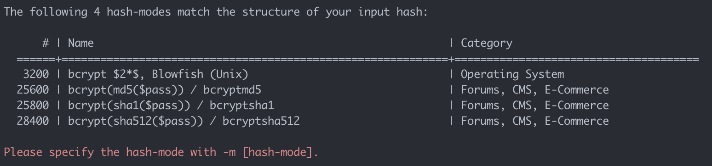

# Hackbook - First challenge - Log In to Léa account

## Intro

This challenge is part of the Hackbook challenge suite.

The final goal is check if your girlfriend Alexia cheats on you. To do this, we will pivot to different accounts that are part of her friends.

In this challenge, we will try to **_connect to Léa's account_**.

Hackbook is very secure, so it is difficult to find a vulnerability allowing access to an account. We will therefore use **OSINT** to find her email and password.

## Steps

### First step : First way - Find the email (OSINT)

**Warning : you have to be logged into Instagram to see the email.
You can create a temporary account if you want to. If you don't want you can use the second method**

After a look at Lea's profile, you may have noticed that her email is not present. It is not written in any post, nor in his bio. However, a link to her instagram account is present in her bio!

Bingo !

One of his friends identified her in a post. You can see that he shared a screen containing his email : ***lea.leroux.gribouille@gmail.com***.

### First step : Second way - Find the email (OSINT)

After a look at Lea's profile, you may have noticed that her email is not present. It is not written in any post, nor in his bio. However, a link to her instagram account is present in her bio!

Bingo !

You decide to try to loggin into Lea's Instagram account and because you are very smart you click on the "Forgot password" button.

Here are the steps to follow to find the email :

Now you have to guess the prefix of the email (simply Lea's username on instagram).  
You can use some tools to test a valid email address : [tool to check email](
    https://captainverify.com/fr/mail-tester.html).

### Second step - Find a vulnerability to get password hash

The hash of a user's password is often saved with user data such as name, email, profile picture, etc. We will try to get them.

As the site is rendered on the server side, with NextJS 13, user data is directly retrieved on the server side and sent embedded in the profile page. Both the plaintext password and its hash are not displayed on Lea's profile, so we will have to find something else.

In the **help center**, an API allowing a third party to retrieve hackbook data is detailed. No token is required. We only need the profile id for Lea which is present in the URL when we're on her profile page (..../profile/**1**).

We found the password hash : **$2b$12$2pD/vfUxCOI5ngzrT54QseXD0oj/uM4uR276Kv7ZsIzYfVzULbEDy** ! All that remains is to break it...

### Third step - Collecting data to create a dictionary

To avoid making a brute force attack, we will try to build a dictionary containing any personal data about Lea that we find.

_Léa seems to like **cats** a lot. Her cat is called **Gribouille**. It is **grey**. She is French and lives in **Toulouse**, in the department **31**. She also talks about a **Netflix** series: **Stranger Things**._

### Last step - Combinator Attack

We can use the Hashcat tool to perform the attack. When trying to detect the hash mode, Hashcat finds 4 of them:

It turns out that Hackbook uses the #3200. Just type the following command to perform an combinator attack :

`hashcat -a 1 -m 3200 pass.txt dico.txt dico.txt`

Hashcat find that the Léa password is **_gribouille31_**.

## Conclusion

You have found Lea's login details:

- ***lea.leroux.gribouille@gmail.com***
- **_gribouille31_**

The flag is in the "Notes" section when you are logged into Léa's account.
**Don't forget to concatenate the flag with the password before to validate it.**
