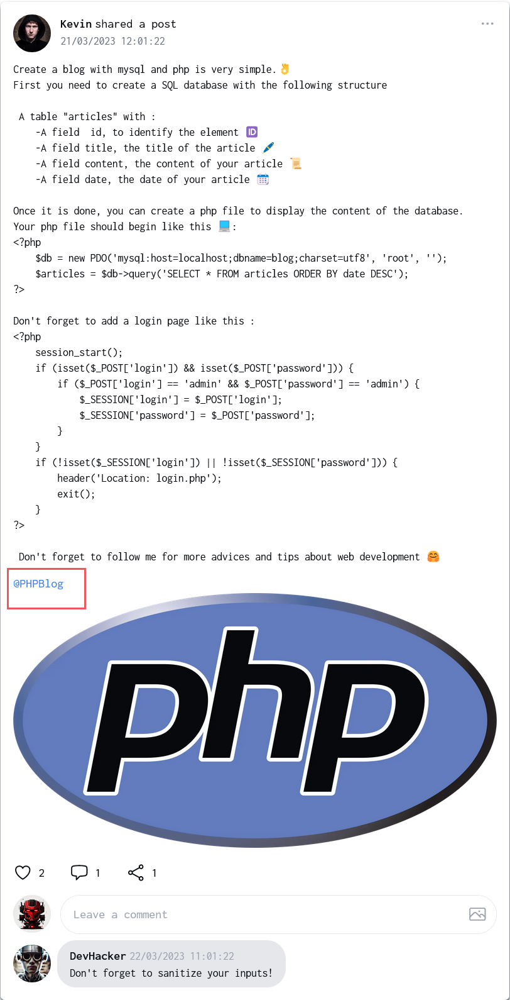
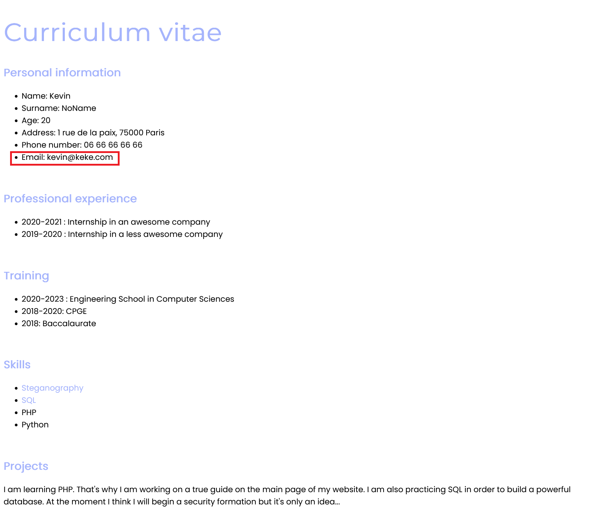
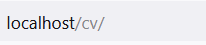
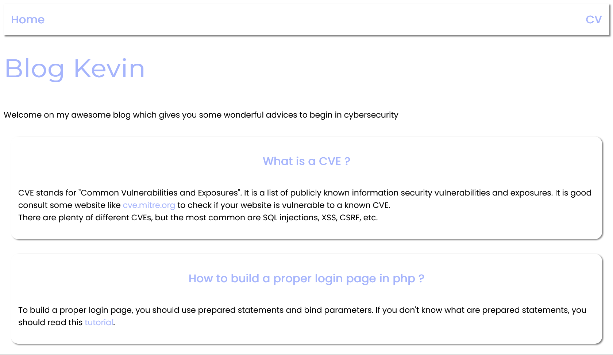
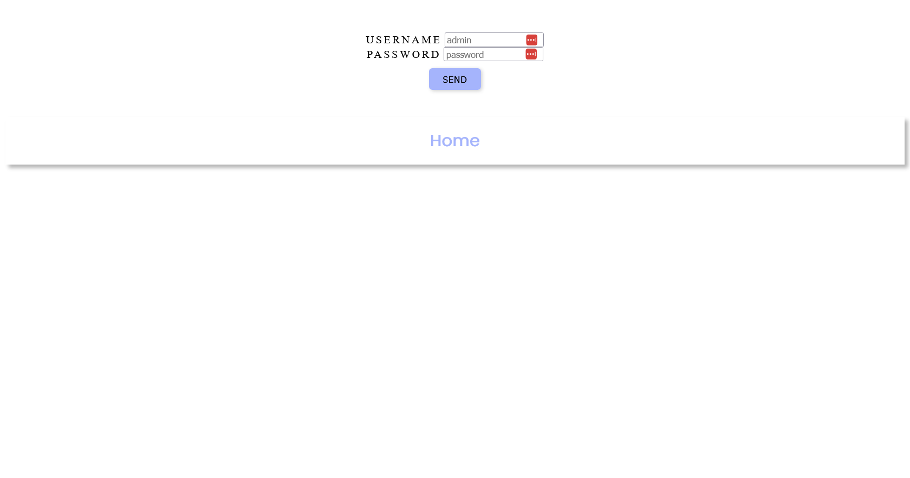
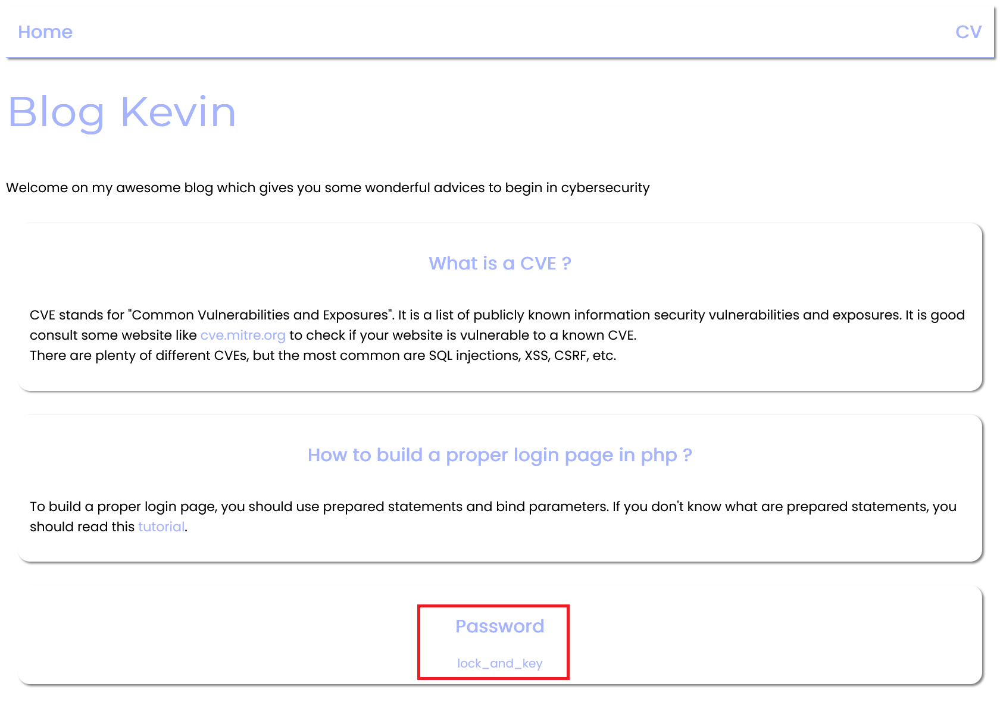

# Hackbook - Second challenge - Log In to Kevin account

## Intro

This challenge is part of the Hackbook challenge suite.

The final goal is check if your girlfriend Alexia cheats on you. To do this, we will pivot to different accounts that are part of her friends.

In this challenge, we will try to **_connect to Kevin's account_**.

Hackbook is very secure, so it is difficult to find a vulnerability allowing access to an account. We will therefore use **OSINT** to find his email and password.

## Steps

### First step - Find the email (OSINT)

After a look at Kevin's profile, you may have noticed that he likes to post a lot about new technologies. One of his posts deals with a tuto about making a blog with PHP and MySql.  
 The most attentives among you may have noticied that is link is present at the end of this post. 

By clicking on the link you can access to Kevin's blog. You can see a page with Kevin's CV and of you course, you can see his email !

### Second step - Find a vulnerability on Kevin's blog

If you pay attention to the URL, you may notice that the cv is on the **/cv** route of the blog :

As we know how website works, you can try to access to the **/** route. You will be redirected to the blog homepage.

It seems that the blog mentions a "login page". That's why it is logic to try to access to the **/login** route. 
And it works ! You can access to the login page of the blog.

### Last step - Using a sql injection to find the password

You can try some common credentials like **admin** or **root**. But it doesn't work. It seems that the blog is protected by a password.

There is an hint about the login. It says bAD credeNtIals Mister". It indicates that the login is "admin". But what about the password ?

You can try to use a **SQL injection** to bypass the password check. You can use the following payload : **admin' or 1=1 ;** or something similar. It will bypass the login form and you will be logged in as admin.

Now, let's go back to the homepage of the blog. You can see that a new post has been published. It is a post about a "password".  
Bingo ! We have found the password of Kevin.

**Note**: *SQL injection which modify or delete data are mitigated by the blog. So you can't use a SQL injection to delete the password of Kevin or data stored in the database. SQL injection which cause a DOS (with SLEEP for example) are also mitigated*

## Conclusion

You have found Kevin's login details:

- ***kevin@keke.com***
- **lock_and_key**

The flag is in the "Notes" section when you are logged into Kevin's account.
**Don't forget to concatenate the flag with the password before to validate it.**
