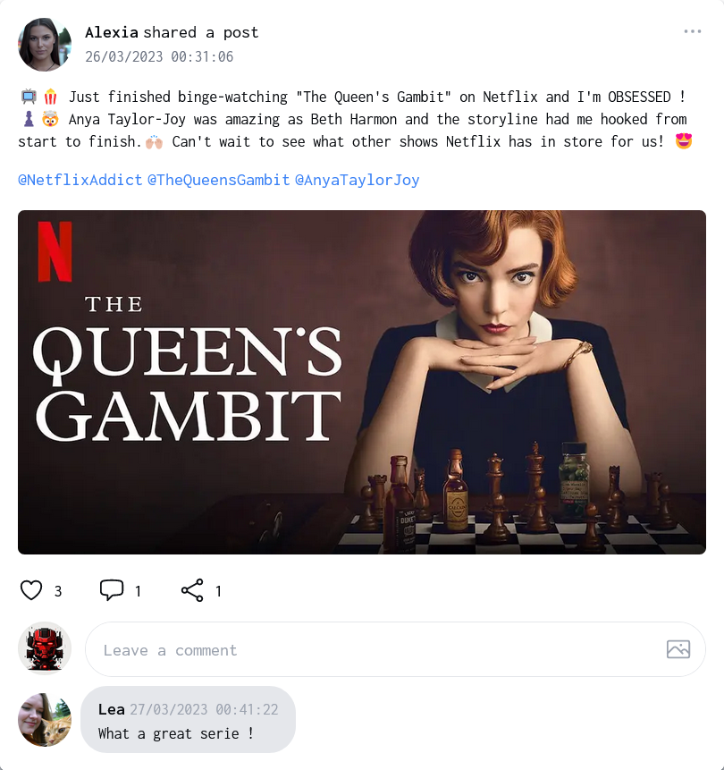
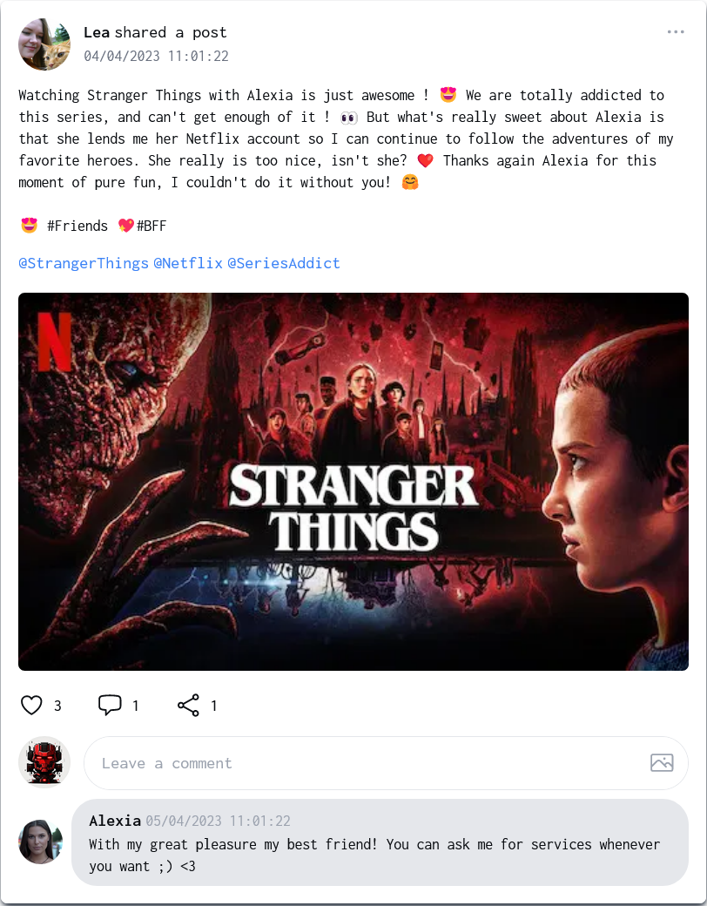
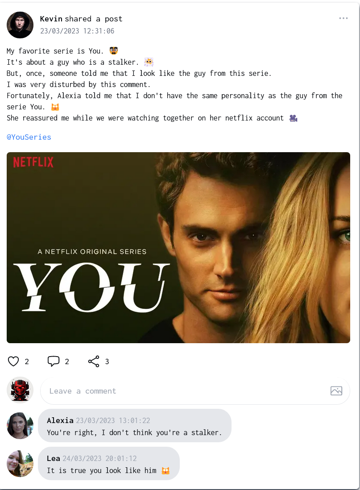
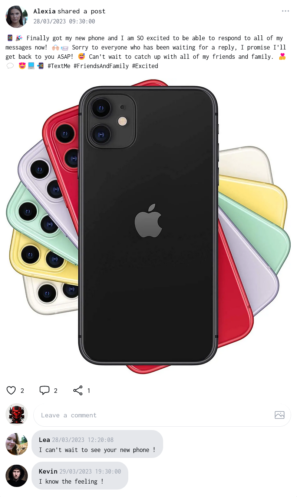

# Hackbook - Third challenge - Log In to Alexia account

## Intro

This challenge is part of the Hackbook challenge suite.

The final goal is check if your girlfriend Alexia cheats on you. To do this, we will pivot to different accounts that are part of her friends.

In this challenge, we will try to **_connect to Alexia's account_**.

Hackbook is very secure, so it is difficult to find a vulnerability allowing access to an account. We will therefore use **OSINT** to find his email and password.

## Steps

### First step - Find the email (OSINT)

After a look at Alexia's profile, you may have noticed that she writes her email in her profile. Don't be surprised, it is not a vulnerability. It is just a bad practice.

### Second step - Find information about Alexia with her profile ? (OSINT)

Ok, so we have found the email of Alexia. But we don't have the password. We will try to find a vulnerability on Alexia's profile.  
She seems to like posting about netflix and series.

Oh wait, you remember that you have seen a post about series on other profiles. It was on Kevin's profile and on Léa's profile. 

According to the posts, Alexia lends her Netflix account to her friends. We have the first crucial information.

Now, you have to be attentive. You can see that Alexia one post mentioning that she likes to text her friends. 

What if one of **her friends** text her about her netflix account ? Maybe she has the password in her phone ?

### Third step - Spoof Kevin or Lea to obtain information from Alexia 

If you try to connect to Kevin's account or Léa's account, you will see that they have no message from Alexia.
But if you ask to Alexia her netflix password, as she is used to lend it to her friends, she will probably give it to you.

**Notes** : Be precise with your question, ask for "the password" will display something funny but not the password :)

### Last step - Never use the same password twice

Unfortunately, Alexia has the same password for her netflix account and for her Hackbook account. So, you can connect to her account with the password you have found.

## Conclusion

You have found Alexia's login details:

- ***alexia@girlfriend.com***
- **j@dOreN3tfl1x**

The flag is in the "Notes" section when you are logged into Alexia's account.
**Don't forget to concatenate the flag with the password before to validate it.**  
**Be sure to check the personal notes of Alexia. You will have an hint for next challenge**
