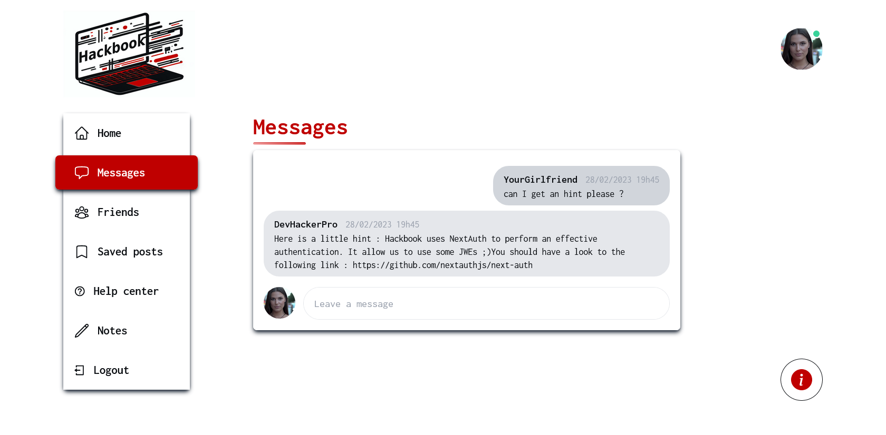

# Hackbook - Last challenge - Log In to Alexis account

## Intro

This challenge is part of the Hackbook challenge suite.

You have reached the alexia account. On her account you have found an hint for a final challenge (or maybe you are some tryharders who don't need challenge 1,2 and 3)!

The password of Alexis is too strong and too hard to crack. You have to break the authentication system. It is based on the Next Auth library and uses JWT (JWE). You have to find the next auth secret used to encrypt and sign JWT/JWE.

## Steps

### First step - Find the secret (OSINT)

In this part you have to find the link of the github repository of Alexis. You can find it easily by looking at Alexis's profile.

Once you click on the link, you will see two directories: dating-app-hackbook and dashboard-admin-hackbook. This last one is just a joke, you have to go to dating-app-hackbook.

In this directory we can understand that Hackbook developers are making a new application named Hackbook Dating. It is interesting to see what are made as commits (the directory is in public so we can see all the commits)

In the commits, we see that there are several stages of development of the application. But if we look, well one step has been published 2 times in a row! It's weird!

Oh yes! We see that a file was deleted which is .env containing the NEXTAUTH_SECRET which is must be the same one as that of the network socail Hackbook for more simplicity for them. 
So we have the NEXTAUTH_SECRET of Hackbook!

### (Step bonus - Find some hints on what to do)

If you have completed challenge 3, you may have found a hint about the secret. Indeed, Alexia had a private which mention that you can ask some help to Alexis (with Alexia's account).

### Second step - Get a valid jwt/jwe token

Just log in to any account, open the developer console and get the **"next-auth.session-token"** cookie.

For example, here it's **_eyJhbGciOiJkaXIiLCJlbmMiOiJBMjU2R0NNIn0..QIwbYkiMtMcQ4rtp.jcjk4pU8Hnl_9JCicUdVC6n04AgGQ8FI8-O_x_OGL_SOKOrUy4T9YnlHf91zsAVrP1P0SVQ50gCoHP_Q28HAcsB2I-zlibGWze_AvaZSHSQH_CURD6Vr6kJllMRgAGe7Sxc-mNwHRjbHm-5nn1l0C2HntMNc0k667hqDS8m7Qs3srx_rEBzfUnMN_AM9PwvSKe7cQr4fNaw.9vy_8s0_K1RqVatQKs-ywQ_**

### Third step - Decrypt, modify and encrypt again to create the new token

The token is encrypted ! chal4.py shows how to decrypt/encrypt a token in Python.

First, you have to decrypt it. You will get a JSON that contains current user data :
`{"name":"Lea","email":"lea.leroux.gribouille@gmail.com","sub":"1","id":1,"iat":1677535626,"exp":1680127626,"jti":"639154eb-a1cb-4f5d-9ca6-5b5d88b211f8"}`

By replacing the id (and sub) we can hope to take on someone else's identity. Alexis's id is 4 (you can find it by going to his profile and looking at the url).

All that remains is to encrypt the payload again and then update the cookie in the browser.

## Conclusion

You have found a vulnerability that allows you to pretend to be anyone. It is important to manage your application secrets well!

The flag is in the "Notes" section when you are logged into Alexis's account.  

**Notes : Becareful, the flag for this challenge is only the flag in the notes and not a concatenation of the flag and the password**