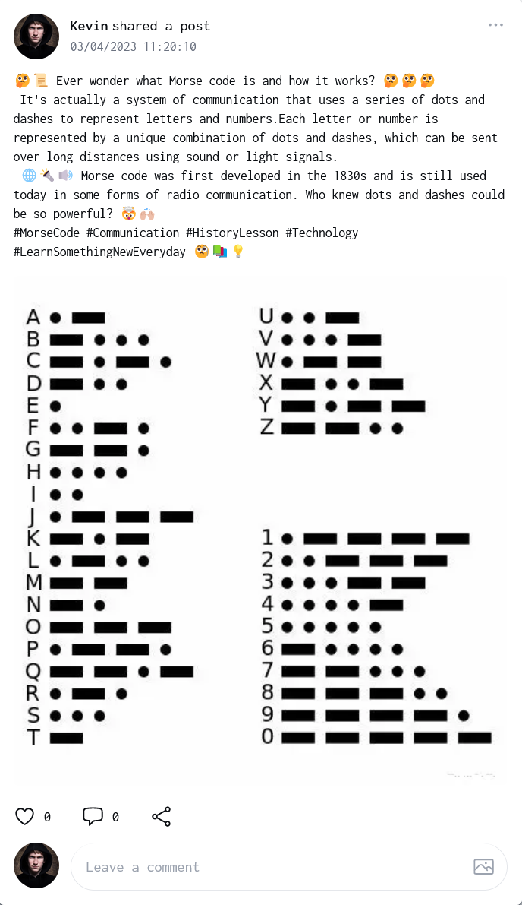
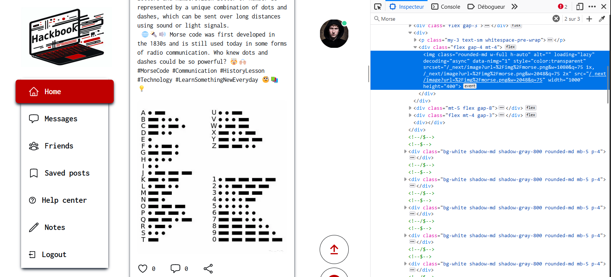
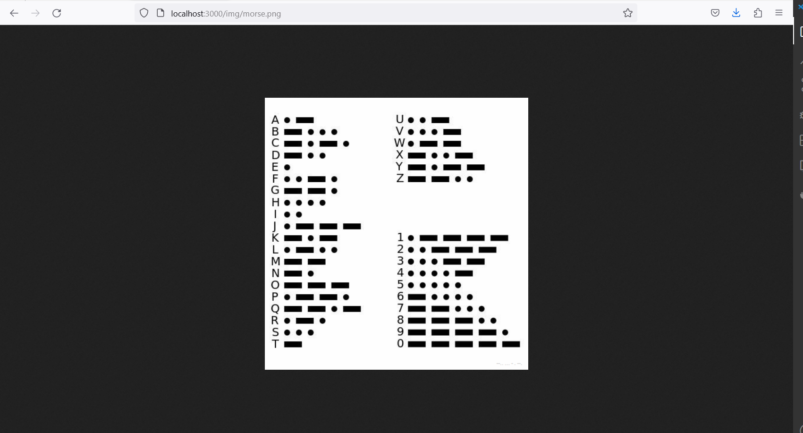
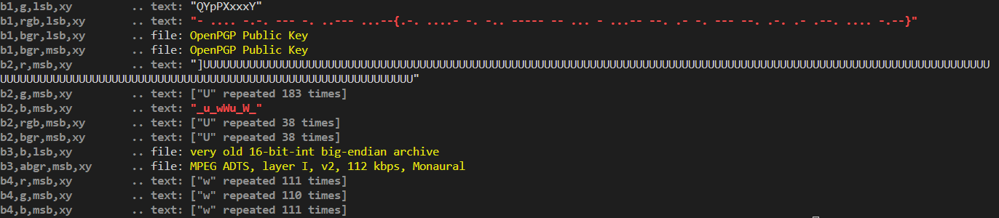

# Hackbook - Bonus challenge 2 - A good place to hide a secret !

## Intro

This challenge is the second bonus challenge of the Hackbook challenge suite.
There is no need to complete the previous bonus challenges to complete this one or the main challenges.

It is just about luck, curiosity and steganography. 

## Steps

### First step - Find the image with the secret 

Among all the posts on the social network, there is one that contains a secret.
It is not very difficult to spot it because it is the only one with a picture with low quality. 



### Second step - Download the image with the secret 

Now that you have found the post, you can download the image with the secret. A right click on the image and `Save image as...` won't do the trick, if you try it you will get a .webp format of the image. 

Instead, you have to open the inspector of your browser and find the div with the post : 



In this div, the most interesting part is le field src wich is "**/_next/image?url=%2Fimg%2Fmorse.png&amp;w=2048&amp;q=75**". 
A quick research on "next web developpement" leads you to the [next.js documentation](https://nextjs.org/docs/basic-features/image-optimization) where you can find the following information :
"A loader is a function that generates the URLs for your image. It modifies the provided src, and generates multiple URLs to request the image at different sizes. These multiple URLs are used in the automatic srcset generation, so that visitors to your site will be served an image that is the right size for their viewport."
It means that the image is not directly available at the url you found, but that it is generated by the server.
The real path to the image is : **/img/morse.png**.



Now you can right click on the image and `Save image as...` to get the image with the secret.

### Third step : Find out there is some steganography in the image

This step is a tricky one. You have to find out that there are two types of steganography in the image.  
The first is the most obvious one : at the right bottom of the image, there is a morse code (−−·· ··· − · −−·) which means "zsteg".Bingo ! You have found the name of the tool you will use to find the secret.


### Fourth step : Decode steganography with zsteg

Now you have to install zsteg on your computer. You can find the installation instructions on the [zsteg github page](
    https://github.com/zed-0xff/zsteg).

You just have to run the following command : 
```bash
zsteg -a img/morse.png
```

Here is the result :



### Fifth step : Decode morse code to get the flag

If you pay attention to the second line of the result, you can see that there is a morse code hidden in the image which is the following : 
"- .... -.-. --- -. ..--- ...--{.-. ....- -. -.. ----- -- ... - ...-- --. .- -. --- --. .-. .- .--. .... -.--}".

You can decode it with [this website](https://morsecode.world/international/translator.html) to get the flag :
**THCON23{^R4ND0MST3GANOGRAPHY}**.

## Conclusion

You have found this steganography flag 
Well done, that was a tricky one !


